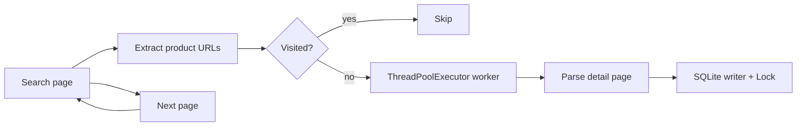

# OLX Pakistan Web Scraper

A production-style, concurrent web scraper for [OLX Pakistan](https://www.olx.com.pk). It crawls keyword search results, extracts structured listing data (including multiple images per product), and persists everything into a normalized SQLite database.

Built as a high-performance distributed-style crawler assignment: thread-based concurrency, session idempotency, adaptive throttling, and thread-safe database writes.

[](https://www.python.org/downloads/)
[](LICENSE)

## Features

- **Concurrent detail-page fetching** via `ThreadPoolExecutor` (main thread stays unblocked for scheduling and metrics)
- **Session idempotency** with an O(1) `visited_urls` set — no URL is fetched or inserted twice in a run
- **Adaptive anti-bot throttling** — random `0–5 s` sleep before every network request
- **Search pagination** — follows next-page links and incremental `?page=N` URLs until the target count is met
- **Rich extraction** — title, price, description, seller, rating, source URL, and all gallery image URLs
- **Normalized SQLite storage** — parent `products` table + child `product_images` table with foreign keys
- **Thread-safe writes** — global `threading.Lock` around all `INSERT` / `COMMIT` operations
- **Structured logging** — console output plus `Execution_Log.txt` at project root

## Tech stack

| Layer | Choice |
|-------|--------|
| HTTP | `requests` |
| HTML parsing | `BeautifulSoup` + `lxml` |
| Concurrency | `concurrent.futures.ThreadPoolExecutor` |
| Persistence | SQLite (`sqlite3`) |
| Language | Python 3.10+ |

## Architecture



| Module | Responsibility |
|--------|----------------|
| `src/main.py` | CLI, scheduler, worker pool, progress metrics |
| `src/scraper.py` | Search URL building, pagination, throttled HTTP |
| `src/parser.py` | Detail-page parsing (JSON-LD + CSS selectors) |
| `src/db.py` | Schema init, `INSERT OR IGNORE`, thread-safe persistence |

## Project structure

```
.
├── src/
│   ├── main.py           # Entry point & scheduler
│   ├── scraper.py        # Index traversal & pagination
│   ├── parser.py         # Detail page extraction
│   └── db.py             # SQLite init & inserts
├── ecommerce_harvest.db  # Generated locally (not in repo)
├── Execution_Log.txt     # Generated locally (not in repo)
├── requirements.txt
├── LICENSE
└── README.md
```

## Prerequisites

- Python 3.10 or newer
- Network access to `olx.com.pk`

## Installation

```bash
git clone https://github.com/Adan-Bhatti/olx-scraper.git
cd olx-scraper

python -m venv .venv

# Windows
.venv\Scripts\activate

# macOS / Linux
source .venv/bin/activate

pip install -r requirements.txt
```

## Usage

Run from the `src` directory:

```bash
cd src
python main.py
```

### CLI options

| Option | Default | Description |
|--------|---------|-------------|
| `--keyword` | `smartphones` | Search keyword (slugified for OLX URLs) |
| `--target` | `1000` | Minimum number of products to collect |
| `--workers` | `8` | `ThreadPoolExecutor` worker count |

Examples:

```bash
python main.py --keyword laptops --target 500 --workers 4
python main.py --keyword "mobile phones" --target 1000
```

On completion, the scraper prints final row counts and writes a full log to `Execution_Log.txt` in the project root.

### Inspect the database

```bash
sqlite3 ../ecommerce_harvest.db "SELECT COUNT(*) FROM products;"
sqlite3 ../ecommerce_harvest.db "SELECT COUNT(*) FROM product_images;"
sqlite3 ../ecommerce_harvest.db "SELECT id, name, price FROM products LIMIT 5;"
```

## Database schema

```sql
CREATE TABLE products (
    id          TEXT PRIMARY KEY,
    name        TEXT NOT NULL,
    price       REAL,
    description TEXT,
    seller_name TEXT,
    rating      REAL,
    source_url  TEXT UNIQUE,
    harvested_at TIMESTAMP DEFAULT CURRENT_TIMESTAMP
);

CREATE TABLE product_images (
    id          INTEGER PRIMARY KEY AUTOINCREMENT,
    product_id  TEXT,
    image_url   TEXT NOT NULL,
    FOREIGN KEY (product_id) REFERENCES products(id) ON DELETE CASCADE,
    UNIQUE(product_id, image_url)
);
```

## Design notes

1. **Concurrency** — Index pages are crawled sequentially on the main thread; detail pages are fetched in parallel workers. Network I/O never blocks scheduling logic.
2. **Idempotency** — `visited_urls` is guarded by a lock. Workers mark URLs before fetching; duplicates are skipped at scheduling time.
3. **Throttling** — `random.uniform(0, 5)` is applied in `fetch_html()` immediately before each HTTP request (search and detail pages).
4. **SQLite safety** — All writes use `INSERT OR IGNORE` inside a `threading.Lock` because SQLite does not support concurrent writers natively.

## Ethical use & disclaimer

This tool is for **educational purposes**. When scraping any website:

- Respect the site's terms of service and `robots.txt`
- Use reasonable rate limits (this project already throttles requests)
- Do not scrape personal data beyond what is publicly listed
- Do not use scraped data for commercial purposes without permission

The authors are not responsible for misuse of this software.

## License

MIT License — see [LICENSE](LICENSE).

## Author

**Adan Bhatti** — [GitHub](https://github.com/Adan-Bhatti)
